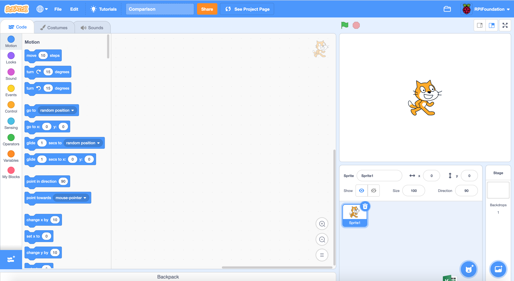

##  The Storytelling approach
There is evidence that gender stereotypes develop early, but little evidence on interventions that target this early development of stereotypes, and none that relate specifically to computing. This pilot intervention focuses on students in KS1 and builds on evidence that teaching computing through storytelling and story-writing is effective with 11-14 year-olds. The trial is exploratory work to investigate whether this is also effective for KS1 (5-7 year olds). This pilot will be evaluated, after which point the results will determine whether the intervention will proceed to a full-scale trial.

In the trial, you will use the Storytelling teaching approach, which aims to use narrative to teach computing. Story writing and digital storytelling are used to introduce computing topics to children when, for instance, teachers might have used game-based computing activities.​ Teachers are provided with resources that centre on teaching pupils computing through programming stories.

During the Storytelling trial, pupils learn to program in [ScratchJr](https://www.scratchjr.org), an age-appropriate programming tool. ScratchJr uses a format that is more similar to writing a story than the regular Scratch tool. In the picture below you can see that you drag and drop blocks into a horizontal ‘storyline’ in ScratchJr, so the relationship with reading or writing a story in Literacy is clear.

This is different to the way the more advanced Scratch tool stacks code in a vertical format, which is closer to text-based programming than storytelling.

The storytelling teaching approach introduces fundamental computing concepts of sequence, repetition and selection. The trial focuses on two strands of storytelling:
story-writing (structure) digital storytelling (includes animation, graphics and audio to portray a story).

**Story-writing** is a means of exploring computer programming. Pupils use these skills to:
+ construct a story
+ organise code around programming constructs
+ Sequence (an algorithm such as beginning/middle/end)
+ Repetition (iteration)
+ Selection
+ input and output processes through the use of characters
+ problem solve as the program develops.

**Digital storytelling** is used as a brief for creating programs. Pupils’ programs are converted into digital artefacts through the use of images, voice narration, music, text and motion for interactive animations. Digital storytelling requires pupils to be innovative and structure their ideas around a narrative.

Click the green button (below right) for the next step in this session.

If you need to go back to the list of contents for this session (Session 1), click [here](https://projects.raspberrypi.org/en/projects/KS1StorytellingTraining_Session1_GBICi1b).
If you need to access the menu for Session 1 and Session 2 (Parts 1 & 2), click [here](https://projects.raspberrypi.org/en/pathways/ks1-storytellingtraining-gbici1b).
